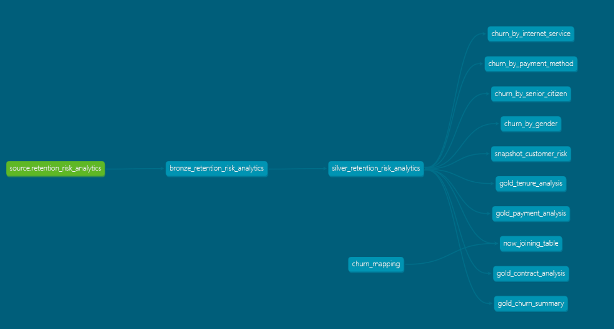

# Customer Churn Analytics Pipeline (dbt + Databricks)

An end-to-end analytics engineering project built using **dbt and Databricks** to analyze customer churn and create business-ready datasets using the **Medallion Architecture (Bronze → Silver → Gold)**.

This project demonstrates modern **ELT pipelines, data modeling, and analytics engineering workflows**.

---

# Project Architecture

---

# Data Pipeline Flow

Source Data  
↓  
Bronze Layer (Raw Data)  
↓  
Silver Layer (Data Cleaning & Transformation)  
↓  
Gold Layer (Business Analytics Tables)  
↓  
Power BI / BI Tools

---

# Tech Stack

- dbt (Data Build Tool)
- Databricks
- SQL
- Git & GitHub
- Power BI
- Jinja Macros
- Data Modeling

---

# Bronze Layer

Raw data ingestion from source tables.

Example model: bronze_retention_risk_analytics

# Silver Layer

Data cleaning and transformation layer.

Operations performed:

- Data standardization
- Column renaming
- Feature engineering
- Tenure grouping
- Data quality improvements

Example model: silver_retention_risk_analytics

# Gold Layer
Business-ready aggregated tables for analytics and dashboards.
https://github.com/atulmali2510/customer-retention-risk-analytics
---

## Churn Summary

## Contract Type Analysis

## Payment Method Analysis

## Tenure Analysis

---
**Atul Sonawane**

Data Analyst  
SQL | Python | Power BI | dbt | Databricks
